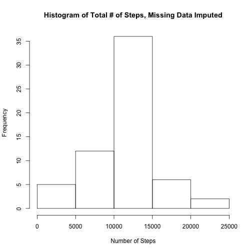
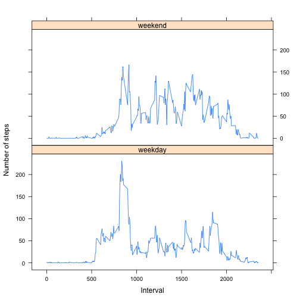

# Reproducible Research: Peer Assessment 1


## Loading and preprocessing the data

```r
# load the data directly from the zip file
dfActivity <- read.csv(unz("activity.zip", "activity.csv"), header = TRUE, as.is = TRUE, 
    sep = ",", colClasses = "character")

# then process the data as needed
dfActivity$interval <- as.numeric(dfActivity$interval)
dfActivity$steps <- as.numeric(dfActivity$steps)
```


## What is mean total number of steps taken per day?

```r
# aggregate the number of steps per date, using the sum function to get the
# total number of steps per date
dfSumAct <- aggregate(steps ~ date, data = dfActivity, FUN = "sum")
hist(dfSumAct$steps, xlab = "Number of Steps", main = "Histogram of Total # of Steps")
```

 


```r
medianNA <- round(median(dfSumAct$steps, na.rm = TRUE), 2)
meanNA <- round(mean(dfSumAct$steps, na.rm = TRUE), 2)
```

These calculations are done ignoring missing values.
Total steps taken per day: *M* = 10766.19, *Mdn* = 10765.

## What is the average daily activity pattern?

```r
# aggregate the steps for each interval using the mean function
dfIntAct <- aggregate(steps ~ interval, data = dfActivity, FUN = "mean")
# then plot the data
plot(dfIntAct$interval, dfIntAct$steps, type = "l", ylab = "Mean # of Steps", 
    xlab = "Interval", main = "Average Number of Steps per Time Interval")
```

 

```r
rowWithMax <- which.max(dfIntAct$steps)
# the actual data is accessed using the row number: steps is
# dfIntAct[rowWithMax,'steps'], interval number is
# dfIntAct[rowWithMax,'interval']
```

The maximum average number of steps is 206.1698 in interval number 835.

## Imputing missing values

```r
# number of missing data
nMissingData <- sum(is.na(dfActivity$steps))
```

The total number of cases with NA is: 2304.

There are several strategies for imputing missing data. The following code checks for any NA of each interval/date and replaces them with the average (*M*) value for that interval. See details in the comments.


```r
# first, we duplicate the original data set
dfActivity2 <- dfActivity
# now we loop through the rows and impute missing data with the average
# (*M*) number steps for the interval this data is stored in the data frame
# dfIntAct, created in the previous step
nOfRows <- nrow(dfActivity2)
# loop through each row
for (i in 1:nOfRows) {
    # in case the number of steps is missing
    if (is.na(dfActivity2[i, "steps"])) {
        # get the number of the interval
        interval <- dfActivity2[i, "interval"]
        # and impute the missing data using the average number of steps for that
        # interval
        dfActivity2[i, "steps"] <- round(dfIntAct[dfIntAct$interval == interval, 
            "steps"])
    }
}
# now we do the same analysis as before aggregate the total number of steps
# per date
dfSumAct2 <- aggregate(steps ~ date, data = dfActivity2, FUN = "sum")
# plot a histogram
hist(dfSumAct2$steps, xlab = "Number of Steps", main = "Histogram of Total # of Steps, Missing Data Imputed")
```

 

```r
medianWithImpute <- round(median(dfSumAct2$steps, na.rm = TRUE), 2)
meanWithImpute <- round(mean(dfSumAct2$steps, na.rm = TRUE), 2)
```

Total steps taken per day after data imputation: *M* = 10765.64, *Mdn* = 10762.

For easier comparison, here is a table of both *M* and *Mdn* before and after data imputation.

|   | *M* | *Mdn* |
|---|-----|---|
| **before imputation**  | 10766.19    | 10765  |
| **after imputation**  | 10765.64    | 10762  |

## Are there differences in activity patterns between weekdays and weekends?

```r
nOfRows <- nrow(dfActivity2)
# loop through each row of the data frame with the imputed data
for (i in 1:nOfRows) {
    # get the POSIX number of the weekday we don't use weekdays(), as this
    # function works different on different locales and OSs
    nWday <- as.POSIXlt(strptime(dfActivity2[i, "date"], "%Y-%m-%d"))$wday
    # if(substr(weekdays(strptime(dfActivity2[i, 'date'],'%Y-%m-%d')),1,1) ==
    # 'S'){ 0 is sunday, 6 is saturday these days are weekend
    if (nWday == "0" | nWday == "6") {
        dfActivity2[i, "wday"] <- "weekend"
    } else {
        # the rest is weekday
        dfActivity2[i, "wday"] <- "weekday"
    }
}
# make wday a factor
dfActivity2$wday <- as.factor(dfActivity2$wday)

# and plot using lattice
library("lattice")
# aggregate the average number of steps per interval and weekday
dfIntAct2 <- aggregate(dfActivity2["steps"], by = dfActivity2[c("interval", 
    "wday")], FUN = "mean")
# draw a plot of the data
p <- xyplot(steps ~ interval | wday, data = dfIntAct2, layout = c(1, 2), type = "l", 
    ylab = "Number of steps", xlab = "Interval")
# print the plot
print(p)
```

 

